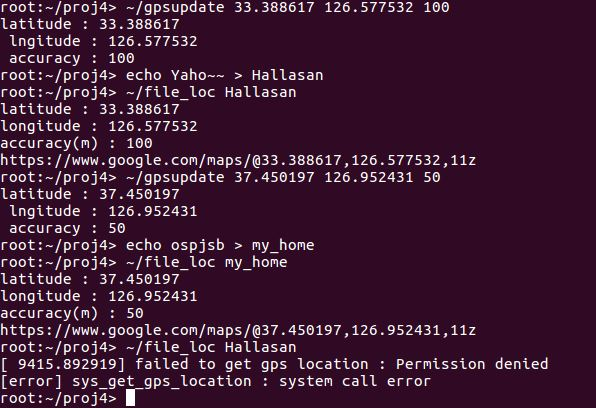

# Project 04

# Geo-tagged File System

# Introduction
The objective of this project is to upgrade file system, geo-tagged ext2 file system. By tagged gps lcation, we also have to control the file permissions. If the distance between location of kernel and the file, which will be calculated from their gps coordinates, is shorter than sum of their accuracy, than our policy decides to give the user permission to access the file. By upgrading whole file system, we can understand how the kernel file system works and how the file system maintains whole the files in the system flawless.

# Implementation

## 1. `gps_location` definition
We made definition of `gps_location` in `include/linux/gps.h`.
```c
struct gps_location {
  int lat_integer;      /* latitude = lat_integer + lat_fractional * 10^(-6) */
  int lat_fractional;   /* range of latitude : [-90, 90] */
  int lng_integer;      /* longitude = lng_integer + lng_fractional * 10^(-6) */
  int lng_fractional;   /* range of longitude : [-180, 180] */
  int accuracy;         /* range of accuracy : nonnegative */
};
```
`lat` stands for latitude, and `lng` stands for longitude. Due to the kernel characteristic that the floating point variables cannot be used, each values are seperated by integer parts and fractional parts.

## 2. system call implementation

### 2-1. `sys_set_gps_location`
This system call is for updating the gps value of kernel. Prototype is below.
```c
int set_gps_location(struct gps_location __user *loc);
```
As you can see, the system call get's only a `gps_location` argument from user. By getting user space's data safely, we used `copy_from_user` and `access_ok` functions. And the kernel's `gps_location` is updated as same as the user's value. By protecting the kernel's location variable, we locked it by `write_lock`. Also this system call checks whether the user's `gps_location` value is appropriate or not.

### 2-2. `sys_get_gps_location`
This system call gets a file's path from user and give user back the corresponding file's `gps_location`. To find out corresponding `inode`, we used `user_path` function. `user_path` is kernel safe function. It calls `strncpy_from_user`, which is copies pathname from user safely.
```c
asmlinkage long sys_get_gps_location(const char __user *pathname, struct gps_location __user *loc)
{
  struct path fp;
  struct inode *inode;
  ...
  int err = user_path(pathname, &fp); /* get struct path from user */
  ...
  inode = fp.dentry->d_inode; /* get inode */
  ...
  {
    ...
    err = inode_permission(inode, MAY_READ);  /* checkout for permission */
    ...
  }
  ...
}
```
Also this system call calls the `inode_permission` like above, which is not specified in project document, to checkout whether the file is okay to be read by user. If the system call decides that this file is forbidden to user, than `gps_location` of the file will not be returned.

## 3. `ext2_inode_operations` implementation
Like previous scheduler project, we have to implement three functions for `ext2` file system and link it to the `struct inode_operations`. There are several files which links the specific file system function pointers to global file system function, but we just linked only one file, `file.c`.

### 3-1. `ext2_set_gps_location`
This function simply set `gps_location` of the file same as kernel's. The important thing is that when does this function should be called. According to the project specification document, the `gps_location` of the file should be updated when the file is modified. So, we decided to track `i_mtime`, which is the member of `inode`, represents the modification time of the file. The reason is that when the file is modified, always `i_mtime` is modified together, and `gps_location` also should be modified. We checked all the kernel source and found out all the points where `i_mtime` is modified, and simply put the function close to them.

### 3-2. `ext2_get_gps_location`
This function is only called by `sys_get_gps_location`, which needs the `gps_location` of specific file. To get `gps_location` from `inode`, the function uses macro `EXT2_I`. `EXT2_I` gets `inode` and returns `ext2_inode_info` pointer. `ext2_inode_info` is the inode information which stays on the memory. 

### 3-3. `ext2_permission`
The core part of this project.
```c
int ext2_permission(struct inode *inode, int mask)
{
  ...
  if (generic_permission(inode, mask)) {
    ...
  }
  ...
  
  /*
   * Additional permission check by gps location and accuracy is below
   */ 
  ...
}
```
Additional permission check should be done by our policy. The assumptions are below.

1. The earth is flat. Using Pythagoras' law, we can calculate distance of two spots precisely.
2. If there is 1 degree difference between two spots, they are 111,644m distant. (111,644m came from 2*pi*6400(km)/360(degree) (actually we adjusted the ratio by 131,072m/degree. The reason is below)

Let's assume that `lat_diff` is difference of latitude between a specific file and kernel. Also `lng_diff` is difference of longitude(degree). `accuracy` is sum of each one's accuracy(m). Then, calculation of `distance` between two spots and permission decision can be done by pseudo code below.
```c 
diff = sqrt(lat_diff^2 + lng_diff^2);  /* degree */
distance = diff * 111,644;  /* meter */
if (distance > accuracy) permission_denied();
else permission_granted();
```
There were some utilization in our actual kernel code. We couldn't use `sqrt()` function, so instead, we compared as squared values. Also because of range limitation of primitive variables, we decided to divide some factors instead of multiplying. Also, the devision operator didn't work well, so we just shift right 17 times(131,072) instead of dividing 111,644.

Fortunately, the assumptions above can cover whole earth surface pretty accurately. We linked the `ext2_permission` function only in `file.c`, not in `symlink.c` and `dir.c` which manages special I/O files and directories.

## 4. user space programs
`gpsupdate.c` updates the kernel's `gps_location` value by getting coordinates from user. It calls `sys_set_gps_location` inside.
`file_loc.c` gets the pathname as string from user, and prints out the coordinates and google maps url. It calls `sys_get_gps_location` inside.

## 5. output

We implemented two files. The first file, named `Hallasan`, actually points Hallasan in jeju island. The second file, named `my_home`, points my home. You can see details above. 

# Lessons Learned
## How file system works
We've already learnt about concepts of file system. Also we've heard some file systems : ntfs, fat32, etc. But we couldn't know how they are designed and works. By upgrading geo-tagged ext2 file system, we had to look around the file systems - inside the `/root/fs`. We could know where `struct inode` is used for, and which data is inside.

## How to upgrade new file system
We could understand how the file system and `inode_operations` are modulated. `inode_operations` have several file system function pointers inside, and other file system kernel codes can use it effectively. Whether some other kernel code is handling directories, special I/O devices, etc.

## How to manage file's permission
By calculating file and devices location information, we had to grant permission to user. By doing that, we could understand how permission can be granted or not, and where in the kernel code should be modified and updated to manage permission appropriately.
